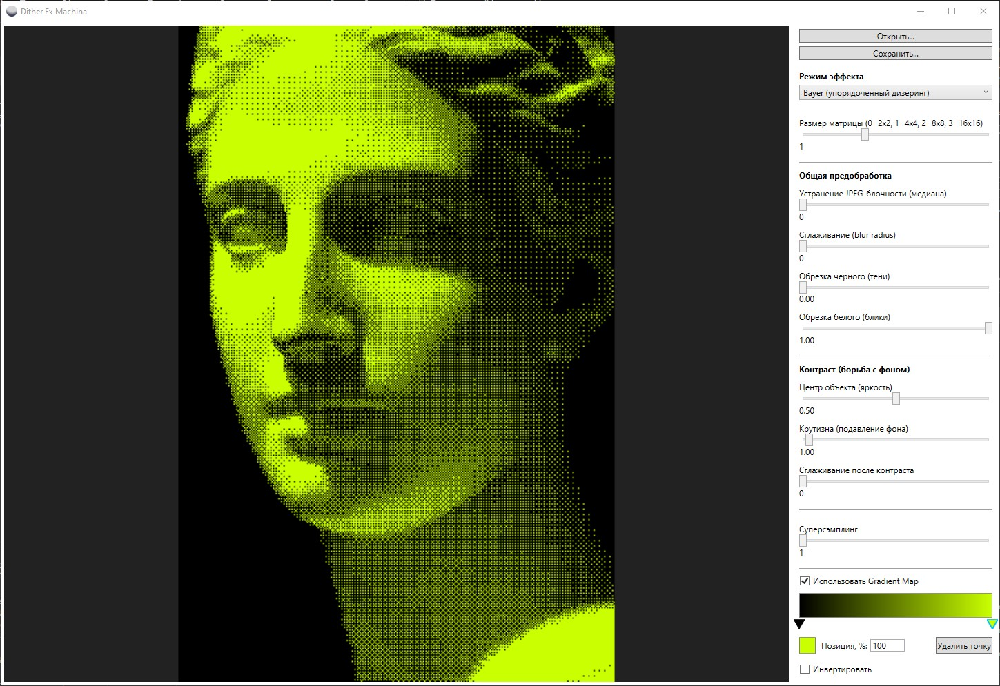
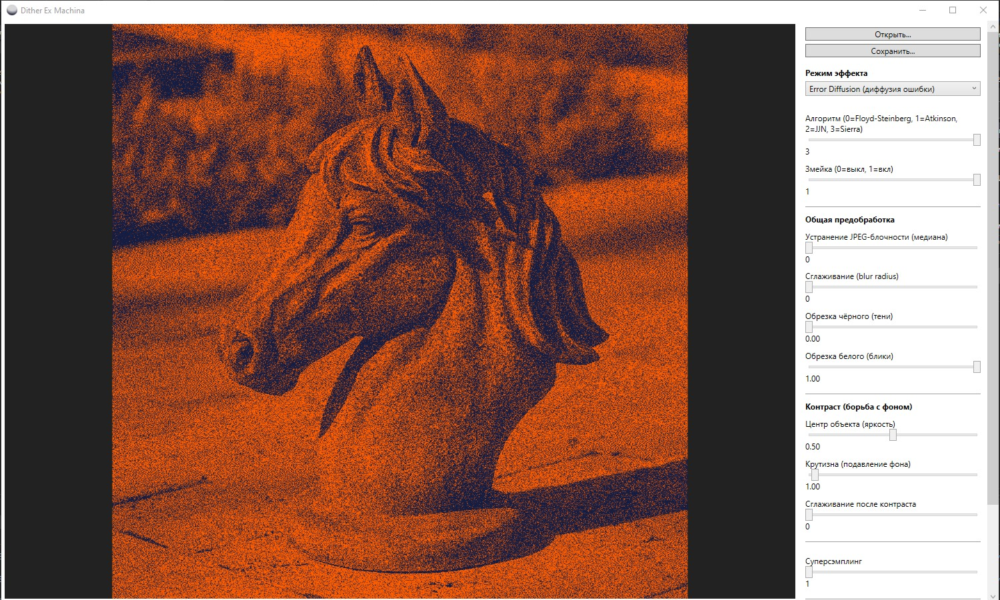
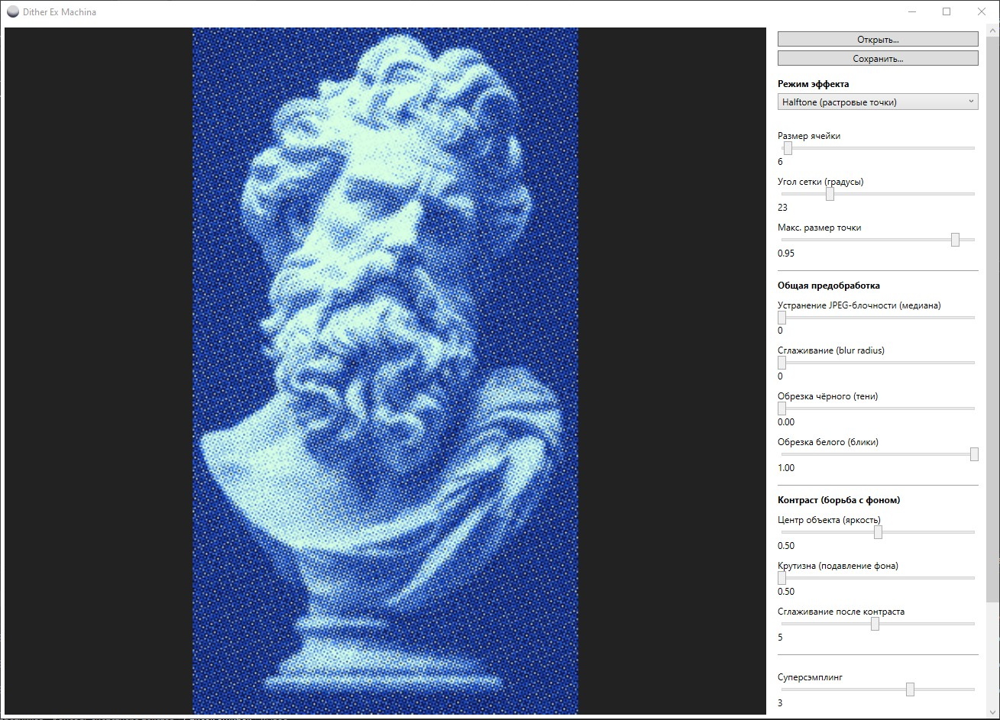
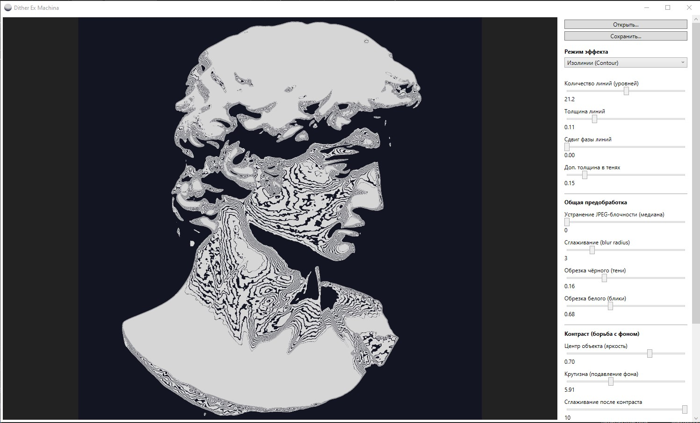
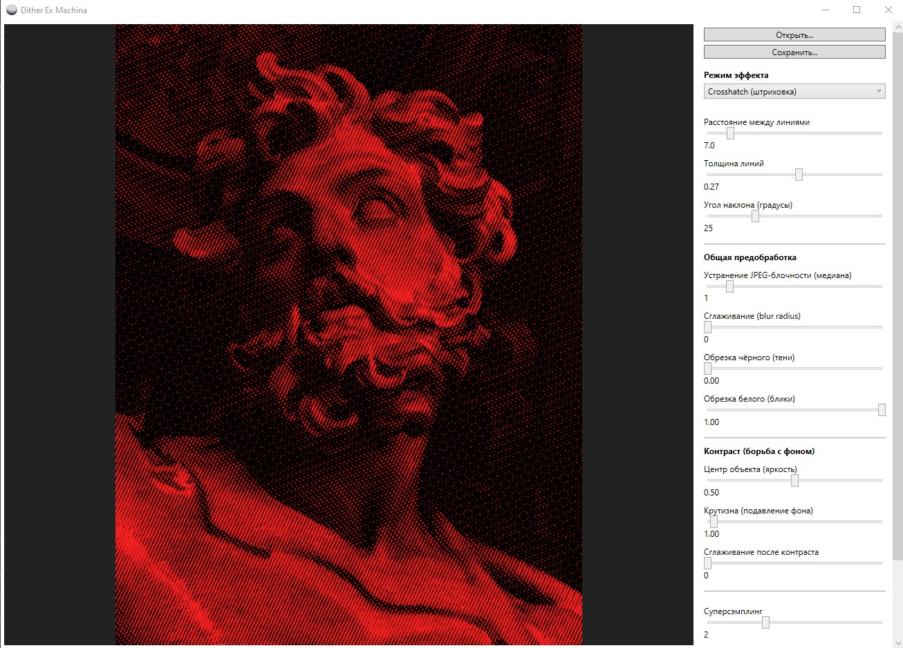

# Dither Ex Machina
[](https://github.com/kiraping1337/dither-ex-machina/releases)

> Десктопное приложение на **WPF (.NET)** для обработки изображений с использованием различных алгоритмов дизеринга и стилизации.

## О проекте

**Dither Ex Machina** – это приложение, позволяющее преобразовывать обычные изображения в стилизованные версии с помощью различных алгоритмов дизеринга.

В отличие от большинства простых демонстраций дизеринга, приложение предоставляет возможность настраивать параметры каждого эффекта, редактировать карту градиента и получать результат практически в реальном времени.

Проект был разработан с упором на чистую архитектуру и расширяемость: каждый эффект реализован как отдельный модуль и может быть легко добавлен в систему без изменения существующей логики.

---

## Возможности

- 📂 Загрузка изображений
  - PNG
  - JPG / JPEG
  - BMP

- 🔧 Несколько алгоритмов обработки
  - Bayer Dithering
  - Error Diffusion
  - Halftone
  - Crosshatch
  - Contour Lines

- 🎴 Настраиваемая карта градиента

- ⚙️ Изменение параметров каждого эффекта

- 👀 Предпросмотр результата

- 💾 Сохранение обработанного изображения

---

## Алгоритмы

### Bayer Dithering

Классический упорядоченный дизеринг с использованием матрицы Байера.

Подходит для получения характерного "ретро" изображения с регулярным расположением пикселей.

Есть возможность выбрать матрицу 2х2, 4х4, 8х8 и 16х16

## 

### Error Diffusion

Алгоритм диффузии ошибки распределяет ошибку квантования между соседними пикселями.

Есть возможность выбрать алгоритм (Floyd-Steinberg, Atkinson, Jarvis-Judice-Ninke и Sierra)



---

### Halftone

Имитация печатного растра при помощи точек различного размера.

Эффект напоминает изображения, используемые в комиксах и манге.



---

### Contour Lines

Преобразует изображение в систему контурных линий, подчеркивающих изменение яркости.

Эффект напоминает топографические карты.



---

### Crosshatch

Создает изображение при помощи системы штрихов различной плотности.



---

## Структура проекта

```
dither-ex-machina
│
├── Controls/      # Пользовательские элементы интерфейса
├── Effects/       # Реализация эффектов дизеринга
├── Models/        # Модели данных
├── Rendering/     # Ядро обработки изображений
├── Utils/         # Вспомогательные классы
│
├── MainWindow.xaml
├── MainWindow.xaml.cs
├── App.xaml.cs
└── App.xaml
```

---

## Используемые технологии

- C#
- WPF
- .NET
- XAML

---

## Архитектура

Каждый эффект реализует общий интерфейс обработки изображения, благодаря чему:

- эффекты независимы друг от друга;
- можно легко добавлять новые алгоритмы;
- пользовательский интерфейс автоматически отображает параметры выбранного эффекта.

Основная логика обработки находится отдельно от интерфейса, что делает проект удобным для сопровождения и дальнейшего развития.

---

## Как собрать проект

### Требования

- Visual Studio 2022
- .NET SDK

### Запуск

```bash
git clone https://github.com/kiraping1337/dither-ex-machina.git
```

Откройте файл решения в Visual Studio и запустите проект.
